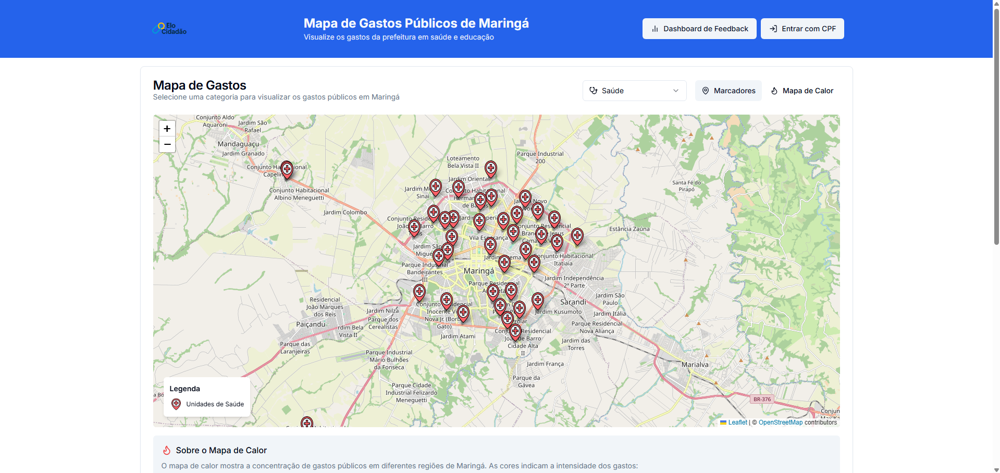
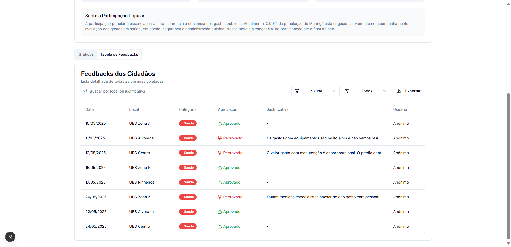

[Acesse a plataforma EloCidadão](https://elocidadao-hackaton.vercel.app/)

🏛️ EloCidadão
EloCidadão é uma plataforma digital desenvolvida com foco em acessibilidade, transparência e engajamento social, promovendo a interação entre cidadãos e governo de forma intuitiva, segura e recompensadora. A proposta visa fortalecer os laços entre sociedade civil e gestão pública, facilitando o entendimento sobre os gastos públicos e incentivando a participação cidadã.

🚀 Tecnologias Utilizadas
Frontend

React

Next.js

TailwindCSS

🧩 Arquitetura e MVP
A arquitetura do projeto foi desenhada com foco em modularidade, escalabilidade e desempenho, adotando uma abordagem centrada no Produto Mínimo Viável (MVP):

Interface responsiva e performática para web e mobile.

Fluxo de dados eficiente e seguro.

Estrutura preparada para expansão e novos módulos.

🎮 Gamificação e Recompensas
O EloCidadão inova ao integrar elementos de gamificação no contexto da gestão pública:

Sistema de créditos por interação (convertíveis em centavos).

Conquistas e desafios relacionados à participação cidadã.

Recompensas simbólicas e práticas, como reuniões com gestores públicos.

📊 Objetivos e Impacto Social
A plataforma visa:

Tornar o acesso à informação pública simples e compreensível.

Valorizar a opinião da população e garantir sua voz ativa.

Auxiliar os órgãos públicos no cumprimento da Lei nº 12.527/2011 (Lei de Acesso à Informação).

Atuar diretamente sobre os seguintes Objetivos de Desenvolvimento Sustentável (ODS):

ODS	Objetivo
11	Cidades e comunidades sustentáveis: gestão participativa.
16	Paz, justiça e instituições eficazes: transparência e participação.
17	Parcerias e meios de implementação: cooperação entre governo e sociedade.

🌐 Visão Geral
EloCidadão representa um passo concreto rumo a uma gestão pública:

Mais transparente

Mais participativa

Mais acessível

Através da interatividade, reconhecimento simbólico e recompensas por engajamento, o sistema transforma a cidadania em uma experiência prática, lúdica e transformadora.

📄 Licença
Este projeto está licenciado sob a MIT License.

### Tela de Login

### Detalhes

### Heatmap

### Gameficação

### Dashboard

### Feedbacks

